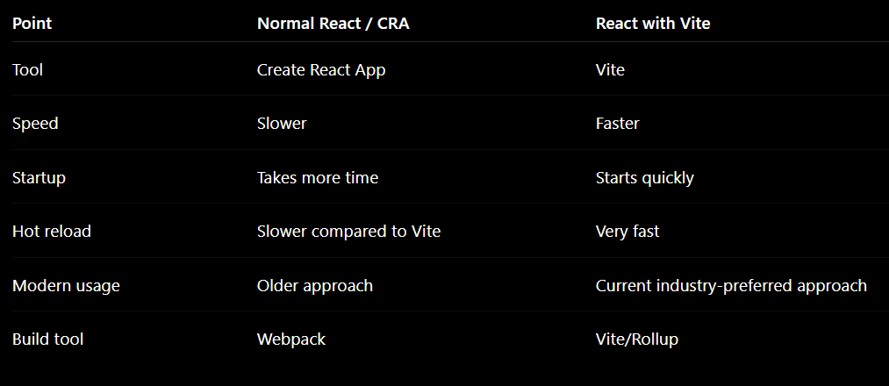

ReactJs:- React is a JavaScript library used to build the frontend/user interface of websites and web applications.

Why React is useful:-Without React, we may write repeated HTML, CSS, and JavaScript.
With React, we can divide the UI into small reusable parts called components.
React is commonly used to build Single Page Applications, also called SPA.

    React is the library.
    Vite is the tool used to create and run the React project faster.

    React itself is only a JavaScript library. It helps us build UI using components.But React alone does not give full project setup like:
                development server
                build command
                file structure
                bundling
                hot reload

    For that, we need a project tool.

    React with Vite means we are creating a React project using the Vite build tool.
    Vite helps us:
                create React project
                run React app
                start development server
                refresh changes quickly
                build project for production

    Example command:
                npm create vite@latest my-app

                

    In simple words:-

                React is like the engine.
                Vite is like the starter kit that helps you run the React engine faster.

                React = UI library
                Vite = project setup/build tool
                React + Vite = modern React development setup

    React is used to build UI.
    Vite is used to create and run the React project faster.
    So React with Vite is the modern way to build React applications.

What is a Single Page Application?
A Single Page Application is a web application that loads one main HTML page and updates only the required parts of the page without reloading the full website.

A Single Page Application is a website that loads once and updates the content dynamically without refreshing the whole page.

Benefits of Single Page Application
1.Fast user experience
Only required content changes, so the app feels faster.
2.No full page reload
The browser does not reload the entire website again and again.
3.Smooth navigation
Moving between pages feels like using a mobile app.
4.Reusable components
React components like Header, Button, Card, and Footer can be reused.
5.Better for modern web apps
Dashboards, admin panels, social media apps, and banking apps often use SPA style.

Component in React:-

    A component is a small, reusable part of the user interface.

    In simple words: Component = one part of a webpage

    Website
    ├── Header
    ├── Navbar
    ├── Login Form
    ├── Button
    ├── Product Card
    └── Footer

    Why do we need Components?
        We need components because real applications are big.

        it provides modularity, testing and Abstraction.

        Example: A banking app may have:
        Login page
        Dashboard
        Account summary
        Transaction table
        Profile page
        Buttons
        Forms
        Cards
        Navbar
        Footer

        If we write everything in one file, the code becomes messy and difficult to manage.
        So we divide the UI into small parts called components.

    Advantages of components

    Reusability
        You can create one component and use it many times. For example, one button design can be reused in many pages.

    Easy to manage
        Each component is separate, so the project becomes clean and organized.

    Easy to debug
        If there is a problem in the login form, you can check only the login component instead of checking the entire application.

    Easy to update
        Suppose the same button is used in 20 places. If you want to change the button style, you only update the button component once.

    Better structure
        Components make large applications easier to understand, especially when working in a team.

A component is a reusable UI part in React.
React application means a collection of components working together.

Jsx:-
JSX stands for JavaScript XML.
In simple words, JSX allows us to write HTML-like syntax inside JavaScript.

React uses JSX to describe what the UI should look like.

Example idea:
JavaScript + HTML-like syntax = JSX

Why do we use JSX?
Normally, HTML and JavaScript are separate.
But in React, UI and logic work closely together. JSX helps us write the UI structure inside the component in a clean and readable way.

Props:-
Props means properties.

In simple words:
Props are used to pass data from one component to another component.
Usually, data is passed from a parent component to a child component.

Why do we need props?
We need props because the same component may need to show different data in different places.

Example:
Imagine you have a Student Card component.

One card should show:
Name: Dulquer
Age: 22

Another card should show:
Name: Priya
Age: 21

Instead of creating separate components for Dulquer and Priya, we create one reusable component and pass different data using props.

Advantages of Props

    Reusability
        One component can be reused with different data.

    Dynamic content
        The same component can display different names, prices, images, titles, or messages.

    Clean structure
        Data can be managed in one place and passed to smaller components.

    Less duplicate code
        We do not need to create separate components for every small data change.

    Better component communication
        Props help components share information in a simple way.

Props are values passed from one component to another component to make components reusable and dynamic.

Props are immutable, Read-only.

Passing arrays or object to props

Rendering array or list

Rendering array of objects

Rendering Componenst in loop
